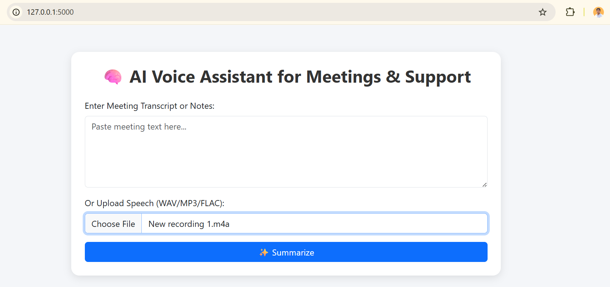

## 🤖 AI Voice Assistant for Customer & Meeting Support

A multimodal web application that summarizes **audio and text-based meetings** into concise insights using transformer-based NLP models. The system supports speech-to-text processing, sentiment analysis, and intelligent summarization to help users quickly understand conversations without reviewing full transcripts.

## 📸 Output Screenshots

### 🎙️ Audio Input Summary

### 📝 Text Input Summary

### 😊 Sentiment Analysis

